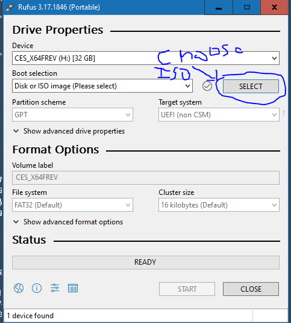
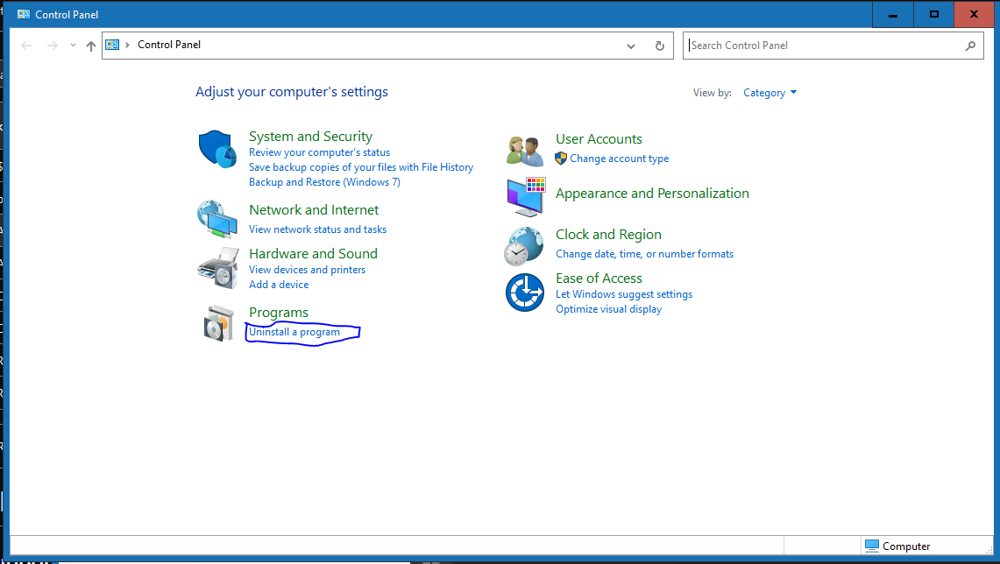
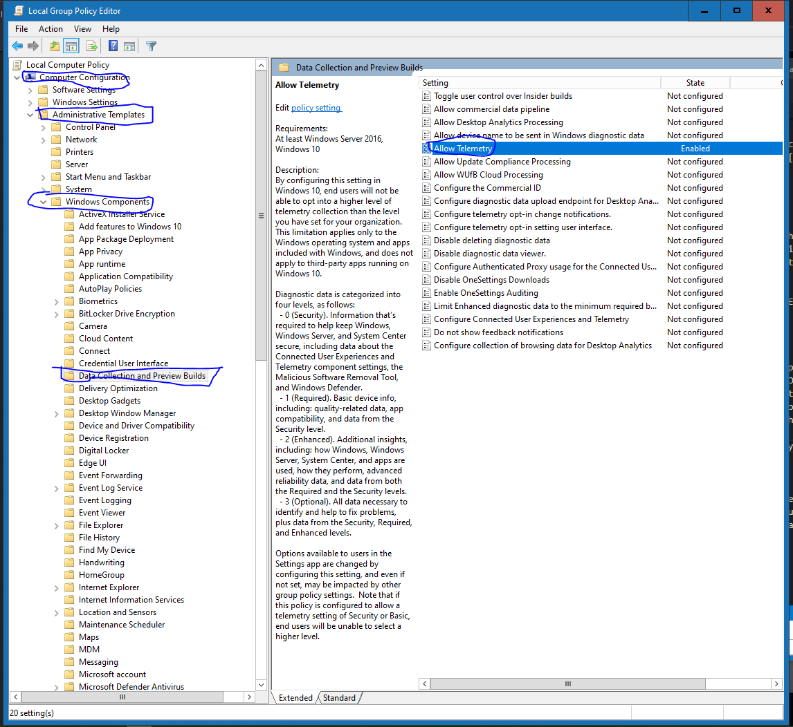
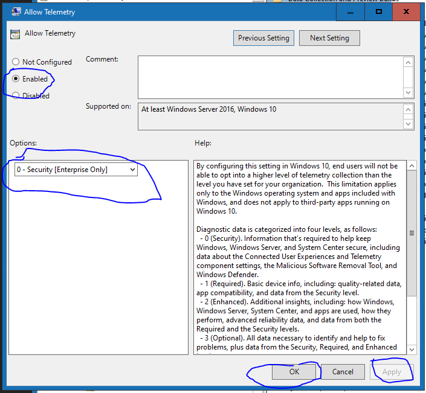

# Windows 10 LTSC Guide
 This is a guide on how to install, activate, and get rid of telemetry on windows 10 LTSC Enterprise or IoT
# Download The ISO
First thing's first, you need to download the iso file for Windows 10 LTSC, this is something you won't find directly from Microsoft. Don't be fooled though, it is an official ISO, it's just the build on their site is outdated.
Download your respective iso [here](https://stuff.mtt-m1.workers.dev/Windows%2010/Windows%2010%20Enterprise%20LTSC%202021/).
# Creating a USB
Now using our ISO, we can create a USB with the installation files on it. We cannot modify the ISO until the files are on the USB (unless you want a bunch of pain in suffering ;) ). To do this, my tool of choice is Rufus. You can download a copy of Rufus from [rufus.ie](https://rufus.ie). Once you have rufus downloaded, open it as an administrator (I'm assuming you know how to do that if you're reading this guide, if not, you're shit outta luck). At the top where it shows select ISO, choose our Windows 10 LTSC ISO. Then hit start, for most people the defaults will be more than sufficient. 

# Setting up auto activation
Alright, for this part, we are going to create a folder and copy it to our USB that will auto activate as we are installing. To do this, you will need KMS_VL_ALL. You can download KMS_VL_ALL [here](https://github.com/kkkgo/KMS_VL_ALL/archive/refs/heads/master.zip). Once you have that downloaded, unzip it. Inside of the folder, you will see a folder called $OEM$. Copy the $OEM$ folder, and go to your Windows 10 LTSC USB thumb drive. Open the sources folder, and paste the $OEM$ folder in the sources folder. You can now eject your drive.

# Installation
I'm not going to walk you through the Windows installation, however if you've done it before it's super easy, just a few less steps since it will pre activate for you. However, I should note, if you are using ethernet, unplug your cable, and for you WI-FI users, when it prompts you to connect to a network, do not connect to a network, this will make "debloating" (I have debloating in quotes as the only real bloat is microsoft edge) a pain in the ass.
# Debloating and removing telemetry
Ok, we're basically done now, but DONT CONNECT TO THE INTERNET YET!!! We have work to do. First, open up the classic control pannel. Click "Uninstall a Program".

Once in this menu, click Microsoft Edge, and then uninstall.
## Telemetry
Now assuming you unslided all the things during initial setup, this should be a walk in the park. If you want this to be easier, just install winaero tweaker and disable telemetry with it. Ok, we have to disable telemetry. This is fairly easy. Open the start menu, and search for "gpedit.msc", once done typing this, hit enter. This will bring up the Group Policy Editor. Choose Computer Configuration, then Administrative Templates, then Windows Components, then Data Collection And Preview Builds. Now you will see an option saying "Allow Telemetry". Double click this policy, then choose "Enabled" in the popup window. Now hit the dropdown menu and click Security (Enterprise Only). What this does is it tells the computer we don't want it to phone home to microsoft, despite the irony of the policy being called "Allow Telemetry". Hit apply, then OK. Now reboot.

# You're Done!
Congrats, you have a debloated Windows 10 Install with little to no telemetry! Go play some Call of Duty Warzone, create the next million dollar painting in MS Paint, do whatever the hell you want, because Microsoft won't know you're doing it. In all honesty, if you found this guide useful, you can donate to me on paypal [here](https://paypal.me/quinnshady007?country.x=CA&locale.x=en_US). Enjoy your fresh cleaned Windows!
